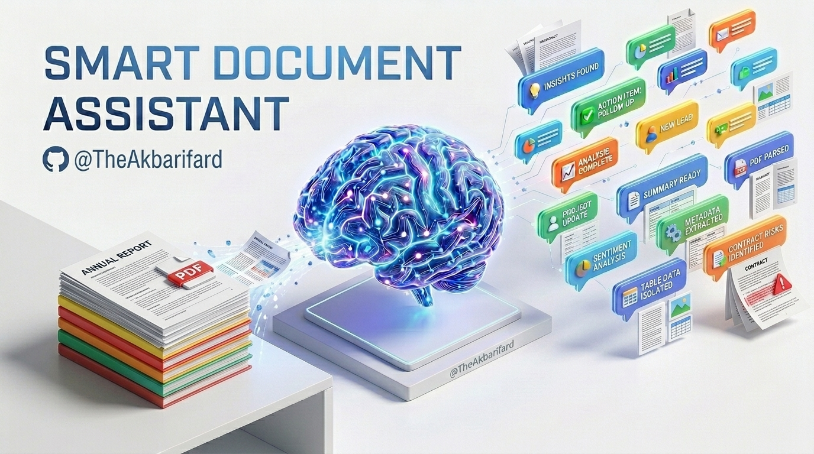

<div align="center">
  
</div>

# 🤖 Smart Document Assistant (RAG)

An enterprise-grade Retrieval-Augmented Generation (RAG) application built with Streamlit, LangChain, and Google Gemini. This assistant allows users to upload lengthy PDF documents and chat with them in a highly interactive, context-aware interface.

<div align="center">

[](https://akbarifard-rag.streamlit.app)

*Experience the AI in action directly in your browser!*

</div>

---

## ✨ Key Features

*   **Progressive UI & Focus Mode:** Step-by-step document ingestion that hides the upload interface once the database is ready, ensuring a distraction-free chat experience.
*   **ChatGPT-Style Conversational Interface:** Persistent chat history with visual message containers and isolated context memory.
*   **Bring Your Own Key (BYOK):** Secure API key management allowing users to use the app's default key or provide their own Google API key. *(Note: Currently powered by Gemini, with support for other major APIs coming soon).*
*   **Ghost Bug Prevention:** Utilizes UUIDs for dynamic ChromaDB collection generation, preventing chunk duplication and memory leaks across sessions.
*   **Source Transparency:** Every AI response includes an expandable "Search References" section, displaying the exact text chunks used to generate the answer.

## 🛠️ Tech Stack

*   **Frontend:** Streamlit
*   **LLM & Orchestration:** LangChain, Google Gemini (`gemini-flash-latest`)
*   **Embeddings:** HuggingFace (`all-MiniLM-L6-v2`)
*   **Vector Database:** ChromaDB
*   **Document Processing:** PyPDF, RecursiveCharacterTextSplitter

## 🚀 How to Run Locally

1. **Clone this repository:**
   ```bash
   git clone [https://github.com/TheAkbarifard/rag-assistant.git](https://github.com/TheAkbarifard/rag-assistant.git)
   cd rag-assistant
   ```

2. **Install the required dependencies:**
   ```bash
   pip install -r requirements.txt
   ```

3. **Set up your API Key:**
   To power the AI, you need a Google Gemini API key. You can easily get one for free by following the [Official Google AI Studio Guide](https://ai.google.dev/gemini-api/docs/api-key).
   
   Once you have your key, configure it locally by creating a `.streamlit` folder in the root directory and adding a `secrets.toml` file inside it:
   ```toml
   GOOGLE_API_KEY = "your_actual_api_key_here"
   ```
   > **🛡️ Why this approach?** Hardcoding API keys directly into the source code is a major security risk. Using Streamlit's `secrets.toml` ensures your key remains local and secure (as it is ignored by Git). Additionally, our BYOK (Bring Your Own Key) architecture allows users to input their own keys via the UI if this secret file is missing, making the application perfectly safe and flexible for public deployment.

4. **Run the Streamlit app:**
   ```bash
   streamlit run app.py
   ```

## 🐳 Docker Support
This project is fully dockerized for platform-agnostic deployment. *(See Dockerfile for build instructions).*

## 🔮 Future Roadmap
*   **Multi-Provider API Support:** Expand BYOK capabilities to support other popular LLMs (e.g., OpenAI, Anthropic).